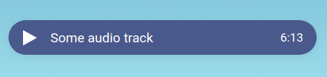

# react-hooks-player


try it [here](https://vault-developer.github.io/react-hooks-player) =)

[](https://www.npmjs.com/package/react-hooks-player)


## Install

```bash
npm install --save react-hooks-player
```

## Usage

```jsx
import React from 'react'
import Player from 'react-hooks-player'

const App = () => {
  return (
    <Player 
      url={}             //required
      title={}           //required
      color={}           //default: '#4b598e'
      background={}      //default: 'white'
      volumeControls={}  //default: true
      height={}          //default: 50
    />
  )
}
```

## License

MIT © [vault-developer](https://github.com/vault-developer)

